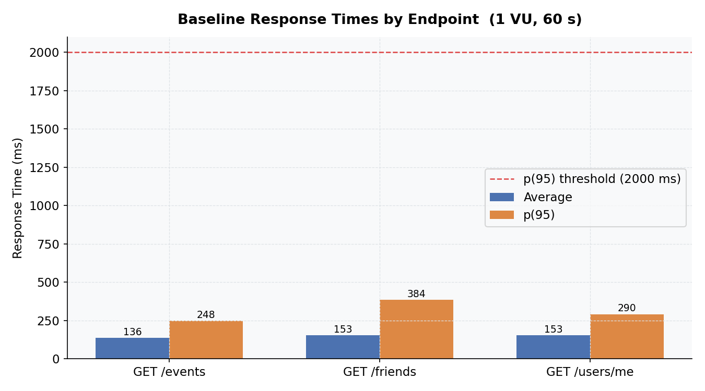
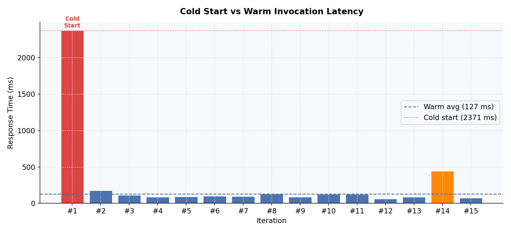
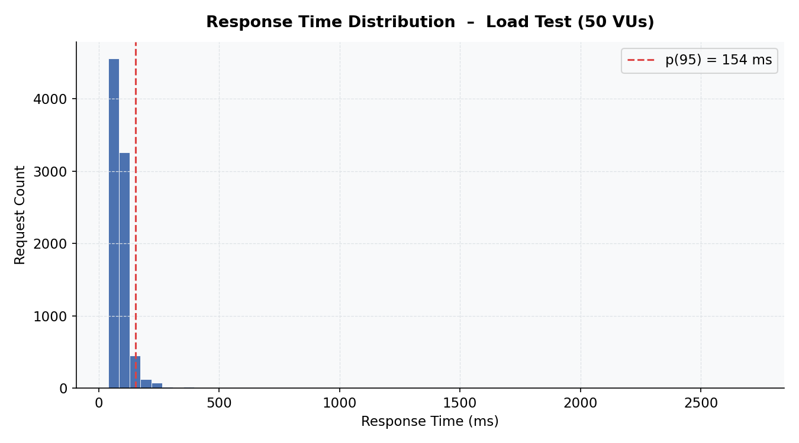
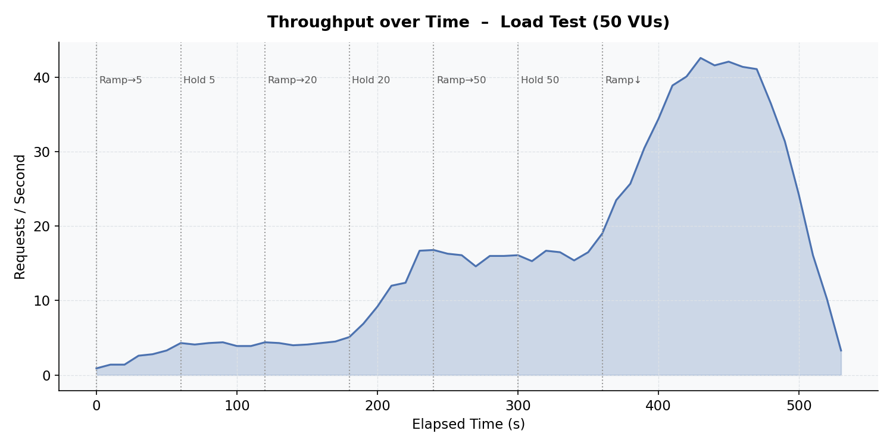
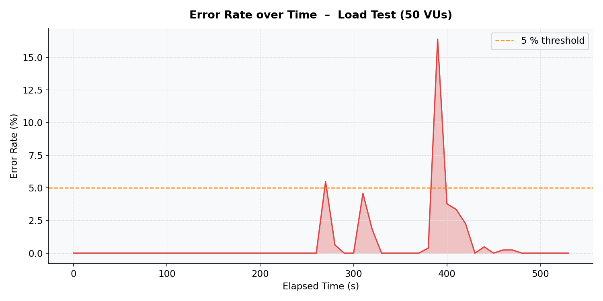
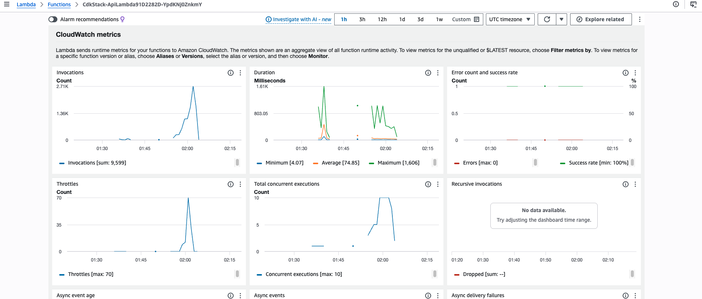

# MidMeet Performance Testing

## 1. How to Run the Tests

This section describes how to reproduce all performance tests for MidMeet's serverless backend (AWS API Gateway → Lambda → DynamoDB).

### Prerequisites

| Tool | Install |
|---|---|
| Node.js ≥ 18 | https://nodejs.org |
| k6 | `brew install k6` (Mac) or https://k6.io/docs/get-started/installation |
| Python 3 + matplotlib | `pip install matplotlib` |
| AWS CLI (configured) | `brew install awscli` then `aws configure` |

### Step 1 — Deploy the backend

```bash
cd backend/cdk
npm ci
npx cdk deploy -c stage=dev
# Note the ApiUrl from the deployment output
```

Seed test data:
```bash
npm run seed
```

### Step 2 — Configure SSM parameters

The venues endpoint requires the following secrets in AWS SSM Parameter Store:

```bash
aws ssm put-parameter --name '/midmeet/dev/GOOGLE_PLACES_API_KEY' --value 'YOUR_KEY' --type 'SecureString'
aws ssm put-parameter --name '/midmeet/dev/ONEMAP_EMAIL' --value 'YOUR_EMAIL' --type 'SecureString'
aws ssm put-parameter --name '/midmeet/dev/ONEMAP_PASSWORD' --value 'YOUR_PASSWORD' --type 'SecureString'
```

To update existing parameters, add `--overwrite`.

### Step 3 — Obtain a JWT token

Fill in `CLIENT_ID`, `USERNAME`, and `PASSWORD` in `get_token.js`, then:

```bash
cd performance_tests
node get_token.js
# Token is saved to token.txt (valid for ~1 hour)
```

### Step 4 — Configure test scripts

In all test scripts, replace:

```javascript
const BASE_URL = 'https://YOUR_API_URL';
```

with the `ApiUrl` from Step 1 (no trailing slash).

### Step 5 — Prepare a test event for venues testing

Create a test event and note the returned `eventId`:

```bash
TOKEN=$(cat token.txt | tr -d '[:space:]')
curl -X POST \
  -H "Authorization: Bearer $TOKEN" \
  -H "Content-Type: application/json" \
  -d '{"name":"Test Meetup","type":"Restaurant","invitees":[]}' \
  https://YOUR_API_URL/events
```

Then manually set the event status to `SCHEDULING` via AWS Console:
**DynamoDB → Tables → midmeet-dev-main → Explore items → PK=EVENT#{id}, SK=METADATA → edit status field**

### Step 6 — Run the tests (in order)

```bash
# 1. Baseline — single user, 60 seconds
k6 run -e TOKEN=$(cat token.txt | tr -d '[:space:]') baseline_test.js

# 2. Venues baseline — single user, 3 minutes (calls Google Places + OneMap)
k6 run -e TOKEN=$(cat token.txt | tr -d '[:space:]') \
       -e EVENT_ID=YOUR_EVENT_ID \
       venues_baseline_test.js

# 3. Cold start — wait 5+ minutes after last request, then:
k6 run -e TOKEN=$(cat token.txt | tr -d '[:space:]') cold_start_test.js

# 4. Load test — ~9 minutes, saves raw JSON for charting
k6 run -e TOKEN=$(cat token.txt | tr -d '[:space:]') \
       --out json=load_results.json load_test.js
```

### Step 7 — Generate charts

```bash
python3 generate_charts.py
```

This reads `load_results.json` and outputs five PNG charts in the same directory.

### Step 8 — Capture CloudWatch screenshots

During or immediately after the load test:

1. Open **AWS Console → Lambda → Functions → your function → Monitor**
2. Set time range to **Last 1 hour**
3. Screenshot **Duration**, **Throttles**, and **Total concurrent executions**

---

## 2. Test Results Summary

### 2.1 Baseline Test — Single User, 60 s

> **Purpose:** Establish single-user latency baseline for standard CRUD endpoints.

| Endpoint | Avg | Min | Median | p(90) | p(95) | Threshold | Result |
|---|---|---|---|---|---|---|---|
| GET /events | 136.37 ms | 70.38 ms | 112.85 ms | 225.85 ms | 248.48 ms | < 2000 ms | ✅ Pass |
| GET /friends | 153.11 ms | 78.42 ms | 108.93 ms | 231.76 ms | 383.63 ms | < 2000 ms | ✅ Pass |
| GET /users/me | 152.75 ms | 77.49 ms | 124.72 ms | 253.20 ms | 290.50 ms | < 2000 ms | ✅ Pass |
| **Overall** | **147.41 ms** | **70.38 ms** | **122.73 ms** | **240.70 ms** | **302.44 ms** | | ✅ **Pass** |

All three endpoints passed the 2,000 ms p(95) threshold with 100% success rate (75/75 checks). The occasional p(95) spike on `GET /friends` (383 ms) is attributable to DynamoDB read latency variability.



---

### 2.2 Venues Baseline Test — Single User, 3 min

> **Purpose:** Measure latency of the computation-intensive venue recommendation endpoint, which calls Google Places API and OneMap Routing API externally.

| Endpoint | Avg | Min | Median | p(90) | p(95) | Threshold | Result |
|---|---|---|---|---|---|---|---|
| GET /events/{id}/venues | 228.79 ms | 102.28 ms | 175.35 ms | 323.98 ms | 468.24 ms | < 30000 ms | ✅ Pass |

Despite invoking two external APIs, the venues endpoint achieved a p(95) of 468.24 ms with 100% success rate (56/56 checks). This is significantly lower than expected due to Lambda-side OneMap token caching, which avoids repeated authentication overhead. The maximum of 1,570 ms corresponds to the first request where the token must be freshly obtained.

---

### 2.3 Cold Start Test — Lambda Initialisation Latency

> **Purpose:** Measure the latency penalty of a Lambda cold start versus subsequent warm invocations.

| Iteration | Response Time | Type |
|---|---|---|
| 1 | **2,371 ms** | 🥶 Cold Start |
| 2 | 177 ms | ✅ Warm |
| 3 | 111 ms | ✅ Warm |
| 4 | 88 ms | ✅ Warm |
| 5 | 92 ms | ✅ Warm |
| 6 | 97 ms | ✅ Warm |
| 7 | 94 ms | ✅ Warm |
| 8 | 127 ms | ✅ Warm |
| 9 | 88 ms | ✅ Warm |
| 10 | 123 ms | ✅ Warm |
| 11 | 124 ms | ✅ Warm |
| 12 | 60 ms | ✅ Warm |
| 13 | 85 ms | ✅ Warm |
| 14 | 441 ms | ✅ Warm (network spike) |
| 15 | 74 ms | ✅ Warm |

| Metric | Value |
|---|---|
| Cold start latency | 2,371 ms |
| Warm invocation average | ~112 ms |
| Cold-to-warm ratio | **~21×** |
| Success rate | 100% |

Iteration 1 took 2,371 ms (~21× the warm average of ~112 ms), consistent with Node.js 20 Lambda cold start behaviour including container initialisation, runtime bootstrap, and AWS SDK setup. From Iteration 2 onwards, latency stabilised immediately at 60–180 ms. The spike at Iteration 14 (441 ms) is a transient network fluctuation, not a cold start.



---

### 2.4 Load & Elasticity Test — Up to 50 Concurrent Users, 9 min

> **Purpose:** Verify Lambda auto-scaling and DynamoDB throughput under a staged ramp-up to 50 concurrent virtual users.

#### Load Stage Profile

| Stage | Duration | Target VUs |
|---|---|---|
| Ramp-up | 1 min | 0 → 5 |
| Steady (low) | 2 min | 5 |
| Ramp-up | 1 min | 5 → 20 |
| Steady (normal) | 2 min | 20 |
| Ramp-up | 1 min | 20 → 50 |
| Steady (peak) | 1 min | 50 |
| Ramp-down | 1 min | 50 → 0 |

#### k6 Results

| Metric | Value | Threshold | Result |
|---|---|---|---|
| p(95) response time | 155.79 ms | < 3,000 ms | ✅ Pass |
| Error rate | 1.26% | < 5% | ✅ Pass |
| Average response time | 97.72 ms | — | — |
| Maximum response time | 2,710 ms | — | — |
| Total requests | 9,543 | — | — |
| Throughput | 17.64 req/s | — | — |
| Peak concurrency | 50 VUs | — | — |

p(95) of 155.79 ms under 50 concurrent users demonstrates effective Lambda auto-scaling. The 121 HTTP 500 errors (1.26%) were concentrated in the 20→50 VU ramp-up window, caused by Lambda throttling (70 throttle events confirmed in CloudWatch) — not application errors. The Lambda-level success rate remained 100%.







#### CloudWatch Monitor (Load Test Period)



*Key observations: 9,599 total invocations, average Duration 74.85 ms, maximum Duration 1,606 ms, peak concurrent executions 10, throttles 70, Lambda-level error count 0.*

---

## 3. Overall Summary

| Test | Key Finding | Status |
|---|---|---|
| Baseline (standard endpoints) | p(95) ≤ 383 ms across all endpoints at 1 VU | ✅ Pass |
| Baseline (venues endpoint) | p(95) 468 ms despite two external API calls | ✅ Pass |
| Cold Start | 2,371 ms cold start → drops to ~112 ms warm | ✅ Expected |
| Load Test | p(95) 155.79 ms at 50 VUs, 1.26% error rate | ✅ Pass |

All defined performance thresholds were met. The primary limitation identified is Lambda throttling at peak concurrency (50 VUs), which can be addressed in production through provisioned concurrency or a concurrency limit increase request to AWS.